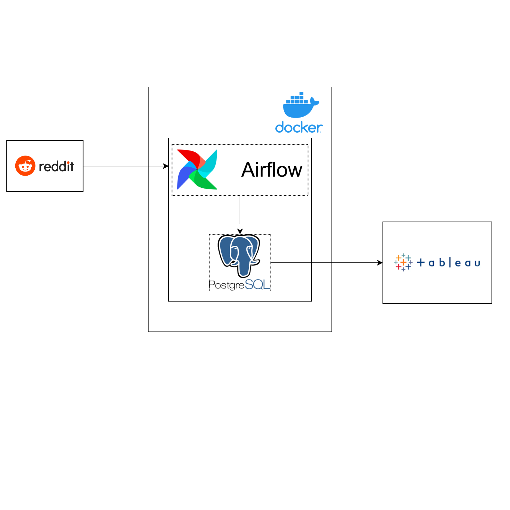

## Reddit Data Engineering Project

### System Diagram:

* Extract, Transform, Load operations are performed using the Reddit API. 
* Airflow running on a docker container is used orchestrate the workflow between extracting, transforming and loading data to PostgesSQL  